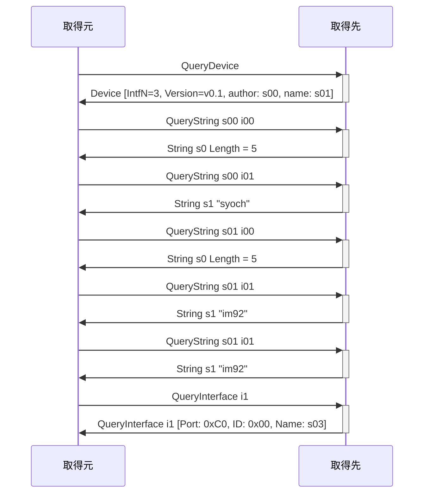

# Ident インタフェース

このドキュメントでは Ident インタフェースの役割及び通信フォーマットについて記載する．

## 役割, 概要

このインタフェースは，デバイスの識別情報を取得するためのインタフェースである．

## 通信概略

以下に通信例のシーケンスチャートを示す．
また， `Device` や `Interface` は暗黙的に送信元のデバイスにものを指す．

```mermaid

sequenceDiagram
    participant A as 取得元
    participant B as 取得先

    A->>+B: QueryDevice
    B->>-A: Device [IntfN=3, Version=v0.1, author: s00, name: s01]

    A->>+B: QueryString s00 i00
    B->>-A: String s0 Length = 5

    A->>+B: QueryString s00 i01
    B->>-A: String s1 "syoch"

    A->>+B: QueryString s01 i00
    B->>-A: String s0 Length = 5

    A->>+B: QueryString s01 i01
    B->>-A: String s1 "im92"

    A->>+B: QueryString s01 i01
    B->>-A: String s1 "im92"

    A->>+B: QueryInterface i1
    B->>-A: QueryInterface i1 [Port: 0xC0, ID: 0x00, Name: s03]
```