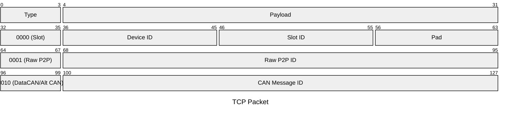

# Interface 一覧

Robobus で使用するインターフェース (機能) の一覧を記載する．

## 共通

この節では，インタフェース解説で使用する用語などについて定義する．

### Route
データの転送経路のこと．
統合回路では，CAN2 (Data CAN) などがある．
加えて，Robobus の規格上で Slot, RawP2P, Multicast などが扱える

また，データ路をシリアライズしたときは次の図のような構造になる



### MotorMode

モータの制御方式を指定するモード．デフォルトでは安全のために `None` が指定されている．
また，幅は `4 bit` である．

- `None`: 駆動させない
- `Velocity`: 開放型の速度制御
- `ClosedVelocity`: 閉じた系における速度制御
- `Angle`: 角度制御
- `Current`: 電流制御

例えば次のデバイスは次のモードをサポートしているべきである
```plain
BLDC: RawVelocity
DC: RawVelocity

RawVelocity + エンコーダ
  RawVelocity, Velocity, Angle

Servo: Angle

Robomaster ESC: Velocity, Angle, Current
```

### Network ID

基本 `32bit` の無線デバイス識別 ID
`32bit` 以下のデータ幅のときは， 0 を上位ビットに敷き詰めることで対応する．
また，一つの RFDevice で使用する ID で重複してはならない．

### Device ID

回路内で使用される `10 bit` 幅の通信用のデバイス識別 ID
無線デバイス識別 ID とは異なることがおおい

### Project ID

プロジェクト固有の `16 bit` 幅の  ID

### リソース種類

リソースの種類で次のようなものがある

## インターフェース一覧

### Enumeratable

- 列挙可能であることを示す
- デバイスが Unintialized 状態のとき， `FindUninitializedDevice` に対し `Advertisement` を返す

### Debuggee

- 識別子を取得
- ログを (データ路) に流す
- リセット
- (UI) Reset

### Rotator

- `MotorMode` として初期化
- `Route` を入力元として設定する-
- `Route` の候補を取得
- (UI): Angle, Velocity, Mode, ClampMaxSpeed, Factor

### App

- 状態を取得

### RFDevice

- `Network ID` からのデータを `Device ID` に `Route` で送る
- `Network ID` に `Route` を送る

### Controller

- `Data Id` を `Route` に流す
- 既知の `Network ID` の個数を取得
- (n) 番目の `Network ID` の情報を取得
- `Project ID` での通信に限定する

### DeviceContainer

- デバイス (+k) を停止/起動する
- 子デバイスの個数を取得
- リセットする方法を提供

### ConnectionManager

- Multicast(~) に酸化する

### EMC Mgr

- `Route` を新しいEMC 経路 (名前) として登録

### Resource Manager

- (リソース種類) を割当要求
- (リソース ID) を開放
