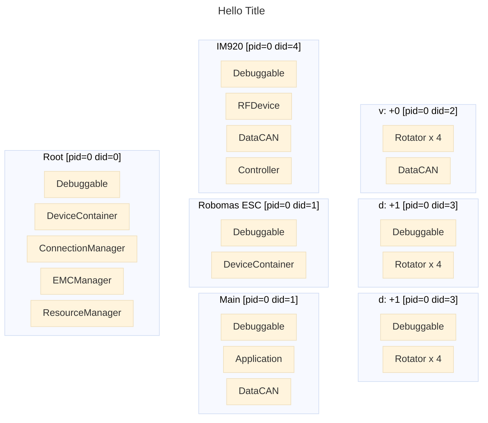

```mermaid
---
title: Hello Title
config:
  theme: base
  themeVariables:
    lineColor: "#fff"
  darkMode: true
  flowchart:
    padding: 10
    nodeSpacing: 10
    subGraphTitleMargin:
      bottom: 20
---
graph LR
  subgraph root["Root [pid=0  did=0]"]
    direction LR
    root_i0[Debuggable]
    root_i1[DeviceContainer]
    root_i2[ConnectionManager]
    root_i3[EMCManager]
    root_i4[ResourceManager]
  end

  subgraph d0["Main [pid=0 did=1]"]
    direction LR
    d0_i0[Debuggable]
    d0_i1[Application]
    d0_i2[DataCAN]
  end
  root --> d0

  subgraph d1["Robomas ESC [pid=0 did=1]"]
    direction LR
    d1_i0[Debuggable]
    d1_i1[DeviceContainer]
  end
  root --> d1

  subgraph d1v0["v: +0 [pid=0 did=2]"]
    direction LR
    d1v0_i0_3[Rotator x 4]
    d1v0_i4[DataCAN]
  end
  d1 --> d1v0

  subgraph d1d0["d: +1 [pid=0 did=3]"]
    direction LR
    d1d0_i0[Debuggable]
    d1d0_i1_4[Rotator x 4]
  end
  d1 --> d1d0

  subgraph d1d1["d: +1 [pid=0 did=3]"]
    direction LR
    d1d1_i0[Debuggable]
    d1d1_i1_4[Rotator x 4]
  end
  d1 --> d1d1

  subgraph d2["IM920 [pid=0 did=4]"]
    direction LR
    d2_i0[Debuggable]
    d2_i1[RFDevice]
    d2_i2[DataCAN]
    d2_i3[Controller]
  end
  root --> d2

```